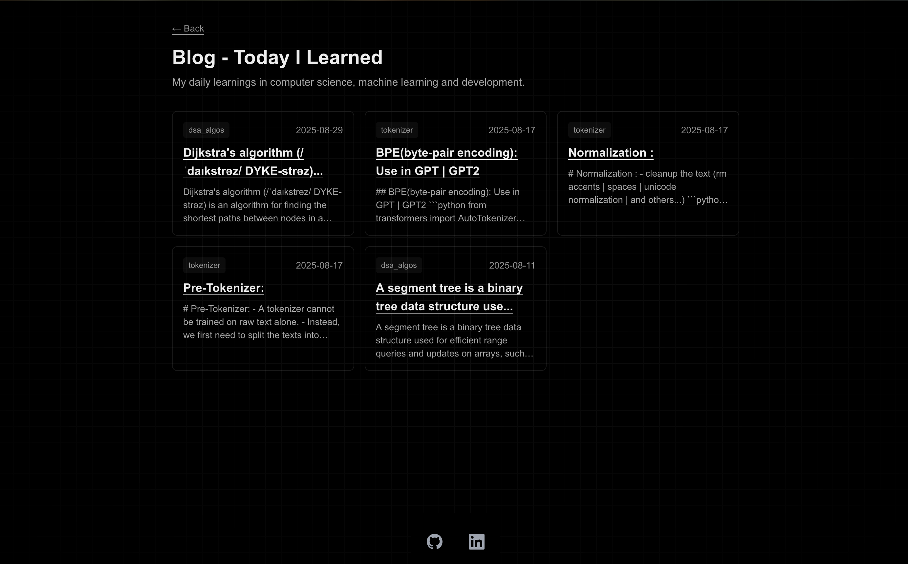

# Today I Learned

My Today I Learned snippets. Inspired by [simonw/til](https://github.com/simonw/til).

11 TILs so far.

You can also find this content on my [website](https://nathan-bensoussan.vercel.app/blog).

## book

- [Deep Learning for Coders with Fastai and PyTorch](https://course.fast.ai/Resources/book.html) - 2025-08-18

## machine_learning

### llm

### tokenizer

- [How normalization work](https://github.com/nathbns/til/blob/main/tokenizer/normalization.md) - 2025-08-17
- [How pre-tokenizer work](https://github.com/nathbns/til/blob/main/tokenizer/pre_tokenizer.md) - 2025-08-17
- [How tokenizer of gpt work ? The BPE(Byte Pair Encoding)](https://github.com/nathbns/til/blob/main/tokenizer/bpe.md) - 2025-08-17

## computer_science

## python

### gradio

- [How to built my first gradio app](https://www.gradio.app/) - 2025-08-23

# pytorch

# hugging face

- [How to push your code to the hugging face space](https://dev.to/koolkamalkishor/how-to-upload-your-project-to-hugging-face-spaces-a-beginners-step-by-step-guide-1pkn) - 2025-08-23

# golang

- [How to code with go - intro course](https://gobyexample.com/) - 2025-08-25
- [Build a cli tool for simplifie navigating in github](https://github.com/nathbns/gitact) - 2025-08-29

# dsa algo's

- [How to implement a segment tree](https://github.com/nathbns/til/blob/main/dsa_algos/segment_tree.md) - 2025-08-11
- [How to implement Dijkstra algo's on graph](https://github.com/nathbns/til/blob/main/dsa_algos/dijkstra.md) - 2025-08-29
