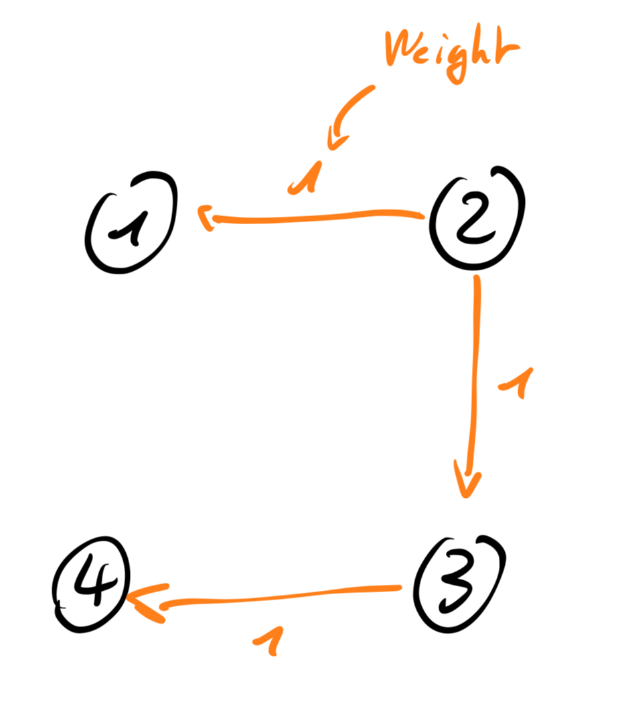

Dijkstra's algorithm (/ˈdaɪkstrəz/ DYKE-strəz) is an algorithm for finding the shortest paths between nodes in a weighted graph, which may represent, for example, a road network. It was conceived by computer scientist Edsger W. Dijkstra in 1956 and published three years later. (https://en.wikipedia.org/wiki/Dijkstra%27s_algorithm)

**When to use a Dijkstra's algorithm?**
- Dijkstra's algorithm finds the shortest path from a given source node to every other node.
- It can be used to find the shortest path to a specific destination node, by terminating the algorithm after determining the shortest path to the destination node.

**C++ Implementation Example on 743. Network Delay Time:**



```c++
#include <iostream>
#include <vector>
#include <unordered_map>
#include <queue>

using namespace std;

class DjikstraGraph {
public:
    unsigned int networkDelayTime(vector<vector<int>>& times, int n, int k) {
        unordered_map<int, vector<pair<int, int>>> graph;
        for (auto& time : times) {
            graph[time[0]].push_back({time[1], time[2]});
        }

        vector<int> dist(n + 1, INT_MAX);
        dist[k] = 0;

        priority_queue<pair<int, int>, vector<pair<int, int>>, greater<pair<int, int>>> pq;
        pq.push({0, k});

        while (!pq.empty()) {
            auto [d, node] = pq.top();
            pq.pop();

            if (d > dist[node]) continue;

            for (auto& edge : graph[node]) {
                int neighbor = edge.first;
                int weight = edge.second;

                if (dist[node] + weight < dist[neighbor]) {
                    dist[neighbor] = dist[node] + weight;
                    pq.push({dist[neighbor], neighbor});
                }
            }
        }

        int maxTime = 0;
        for (int i = 1; i <= n; i++) {
            if (dist[i] == INT_MAX) return -1;
            maxTime = max(maxTime, dist[i]);
        }

        return maxTime;
    }
};

int main(void) {
    DjikstraGraph djG;
    vector<vector<int>> time = {{2,1,1},{2,3,1},{3,4,1}};
    unsigned int ans = djG.networkDelayTime(time, 4, 2);
    cout<<"ans => "<<ans<<endl;
    return 0;
}
```

**Complexity**

- O(V^2)
